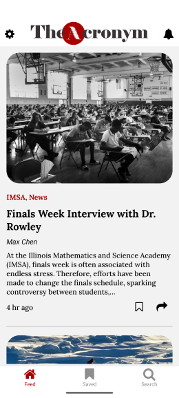
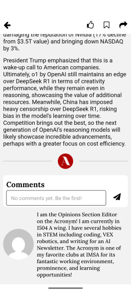
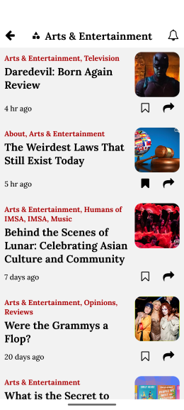
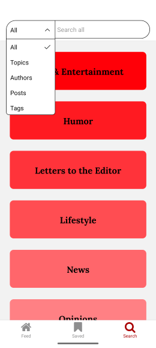
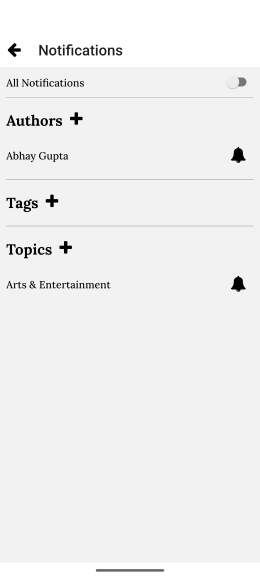
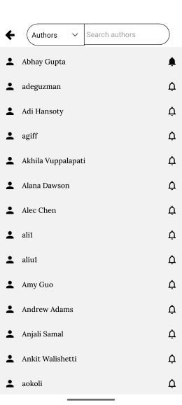
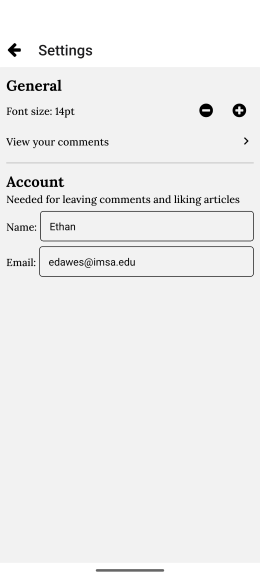
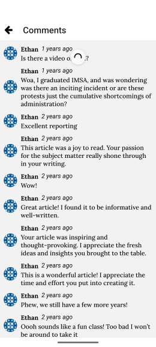

<picture>
  <source media="(prefers-color-scheme: dark)" srcset="./assets/images/acronym_title_dark.png">
  
</picture>

# The IMSA Acronym

The Acronym is IMSA’s (the Illinois Mathematics and Science Academy's) official student-organized newspaper. It was formed by students, for students, in 1987. This repository houses the React Native code for the mobile apps.

## Available on all platforms!
- 🌐 [Website](https://sites.imsa.edu/acronym/)
- 🤖 [Android](https://play.google.com/store/apps/details?id=edu.imsa.theacronym)
- 🍎 [iOS](https://apps.apple.com/app/the-acronym/id6448006404)

## Contributing
[Contributing.md](CONTRIBUTING.md)

## Demo

